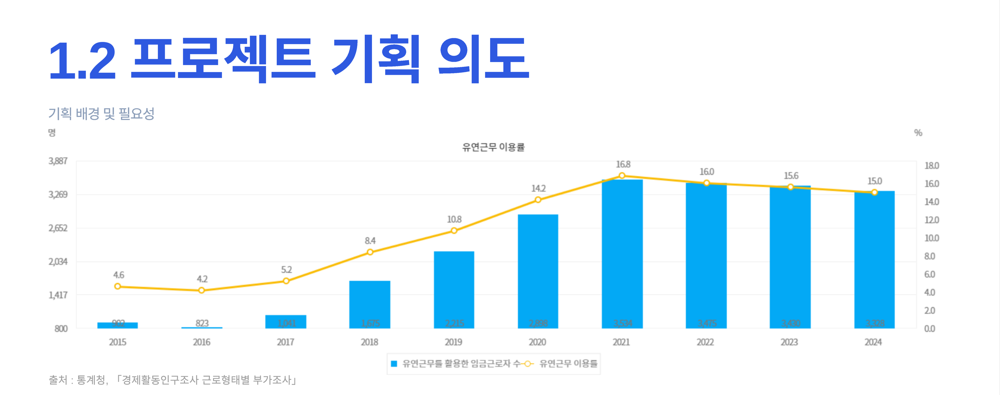

  

## 함께해준 팀원들

<table>
<tr>
  <td align="center">
     
    <b>👨‍💻 윤현기</b> 
    Team Leader & FE&BE 
    🔧 DevOps • 📽️ CamChats • 🔐 Login
  </td>
  <td align="center">
     
    <b>👨‍💻 권지언</b> 
    Backend Developer 
    🗄️ Database • ⚙️ Backend Logic
  </td>
  <td align="center">
     
    <b>👩‍💻 이수민</b> 
    Backend Developer 
    📅 Calendar • 🪣 AWS S3
  </td>
  <td align="center">
     
    <b>👨‍💻 김보성</b> 
    Frontend Developer 
    🎨 UI/UX • 📍 Map
  </td>
  <td align="center">
     
    <b>👨‍💻 임형택</b> 
    Frontend Developer 
    🎨 UI/UX
  </td>
</tr>
</table>

  
## 🛠️ 기술 스택

### **Frontend**

  <table>
    <tr>
      <td align="center" width="120">
        
         <b>HTML5</b>
      </td>
      <td align="center" width="120">
        
         <b>CSS3</b>
      </td>
      <td align="center" width="120">
        
         <b>JavaScript ES6+</b>
      </td>
      <td align="center" width="120">
        
         <b>Thymeleaf</b>
      </td>
    </tr>
  </table>

### **Backend**

  <table>
    <tr>
      <td align="center" width="120">
        
         <b>Java 17</b>
      </td>
      <td align="center" width="120">
        
         <b>Spring Boot 3.5</b>
      </td>
      <td align="center" width="120">
        
         <b>Node.js</b>
      </td>
      <td align="center" width="120">
        
         <b>MyBatis</b>
      </td>
      <td align="center" width="120">
        
         <b>JPA/Hibernate</b>
      </td>
    </tr>
  </table>

### **Database**

  <table>
    <tr>
      <td align="center" width="120">
        
         <b>MySQL 8.0</b>
      </td>
      <td align="center" width="120">
        
         <b>phpMyAdmin</b>
      </td>
      <td align="center" width="120">
        
         <b>Spring Session</b>
      </td>
    </tr>
  </table>

### **보안 및 인증/인가**

  <table>
    <tr>
      <td align="center" width="120">
        
         <b>OAuth2</b>
      </td>
      <td align="center" width="120">
        
         <b>JWT</b>
      </td>
      <td align="center" width="120">
        
         <b>Google Login</b>
      </td>
      <td align="center" width="120">
        
         <b>Kakao Login</b>
      </td>
    </tr>
  </table>

###  **Cam Chats**

  <table>
    <tr>
      <td align="center" width="120">
        
         <b>WebRTC</b>
         <i>P2P 화상통신</i>
      </td>
      <td align="center" width="120">
        
         <b>Socket.io</b>
         <i>실시간 통신</i>
      </td>
      <td align="center" width="120">
        
         <b>MediaSoup</b>
         <i>SFU 미디어 서버</i>
      </td>
    </tr>
  </table>

**실시간 통신 구현 상세:**

| **기술** | **역할** | **성과** |
|:---:|:---|:---|
| **WebRTC** | P2P 연결 및 미디어 스트림 | 지연시간 50ms 이하 |
| **MediaSoup** | SFU 방식 다자간 연결 | 최대 10명 동시 참여 |
| **Socket.io** | 시그널링 및 채팅 | 실시간 메시지 전송 |
| **적응형 비트레이트** | 네트워크 상황 대응 | 연결 안정성 90% |

--- 

### 🚀 **DevOps & distribution **

  <table>
    <tr>
      <td align="center" width="150">
        
         <b>Docker</b>
      </td>
      <td align="center" width="150">
        
         <b>AWS EC2</b>
      </td>
      <td align="center" width="150">
        
         <b>Nginx</b>
      </td>
      <td align="center" width="150">
        
         <b>Jenkins</b>
      </td>
    </tr>
    <tr>
      <td align="center" width="150">
        
         <b>GitHub Actions</b>
      </td>
      <td align="center" width="150">
        
         <b>AWS S3</b>
      </td>
      <td align="center" width="150">
        
         <b>Route53</b>
      </td>
      <td align="center" width="150">
        
         <b>Let's Encrypt</b>
      </td>
    </tr>
  </table>

### **Tools**

  <table>
    <tr>
      <td align="center" width="120">
        
         <b>IntelliJ IDEA</b>
      </td>
      <td align="center" width="120">
        
         <b>Git</b>
      </td>
      <td align="center" width="120">
        
         <b>GitHub</b>
      </td>
      <td align="center" width="120">
        
         <b>Figma</b>
      </td>
    </tr>
  </table>

---

### **Highlights**

<table align="center">
<tr>
<td align="center" width="25%">
  
   <b>🎨 Frontend</b>
   Thymeleaf + JS 반응형 웹 인터페이스
</td>
<td align="center" width="25%">
  
   <b>⚙️ Backend</b>
   Spring Boot + JPA/MyBatis 하이브리드 아키텍처
</td>
<td align="center" width="25%">
  
   <b>🎥 Real-time</b>
   WebRTC + MediaSoup 다자간 화상채팅
</td>
<td align="center" width="25%">
  
   <b>🚀 DevOps</b>
   Docker + AWS + CI/CD 배포 자동화
</td>
</tr>
</table>

## 프로젝트 기획의도

  
    
  <em>📊 출처: 통계청, 「경제활동인구조사 근로형태별 부가조사」</em>

  
원격 근무와 유연 근무 확산으로 조직 내 소통과 협업의 어려움 증가 했고

다양한 협업 툴을 따로 사용하면서 정보가 분산되고 관리가 복잡해지는 불편함 발생 하였습니다.
